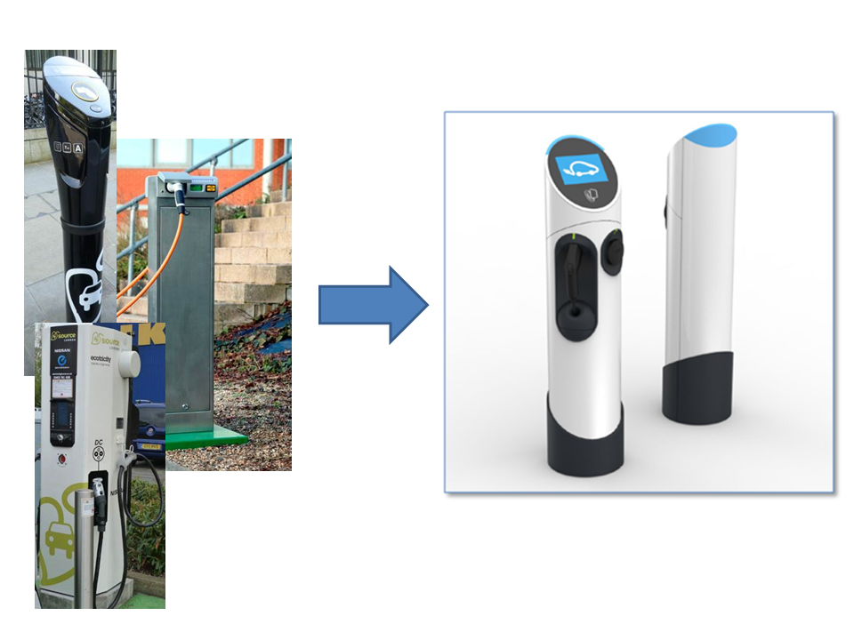
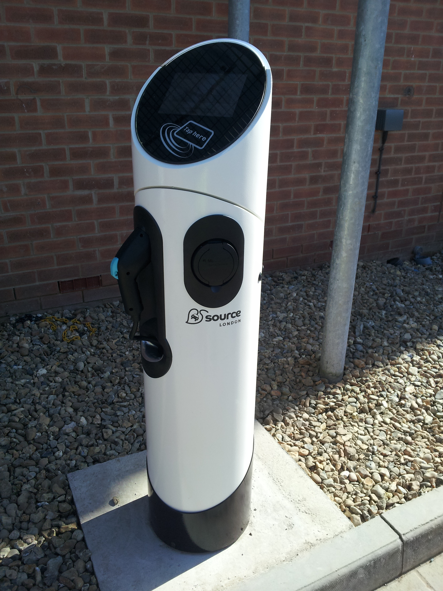
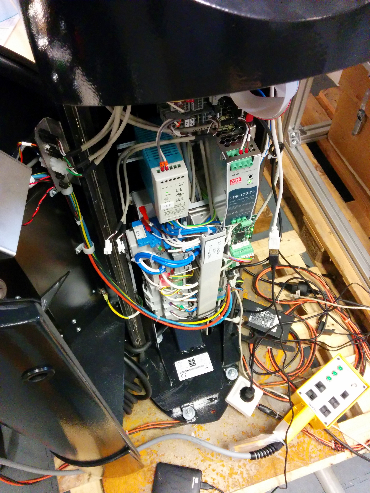
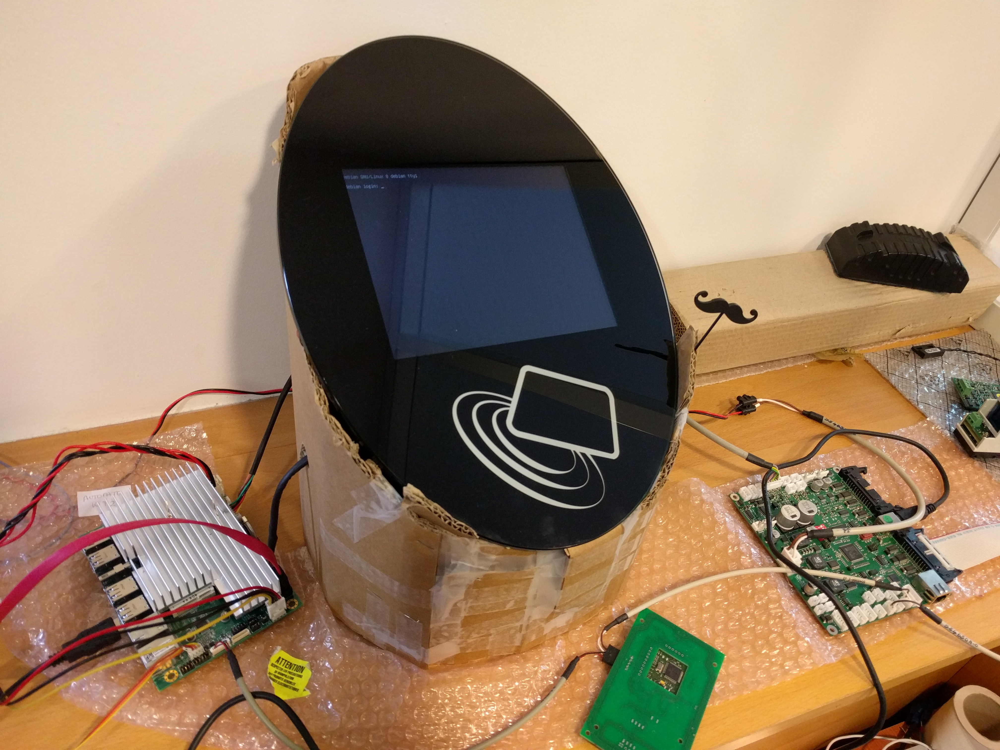
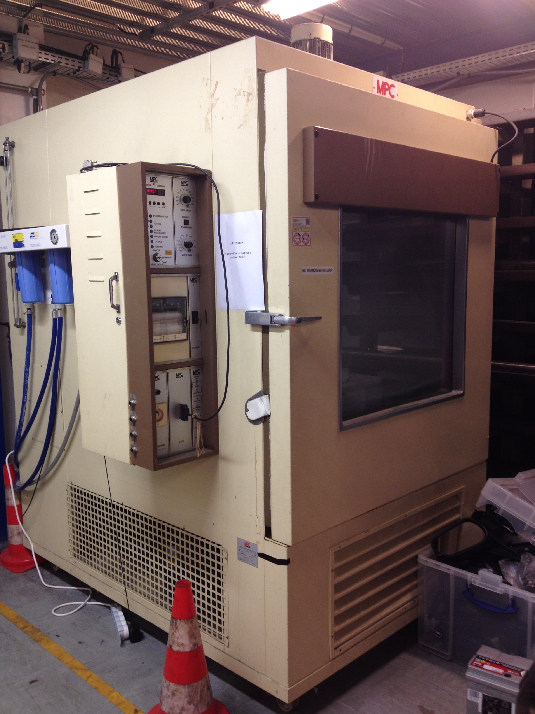
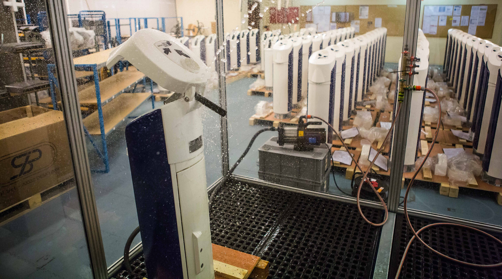
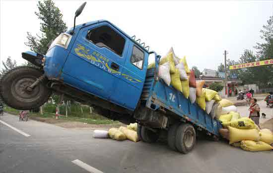
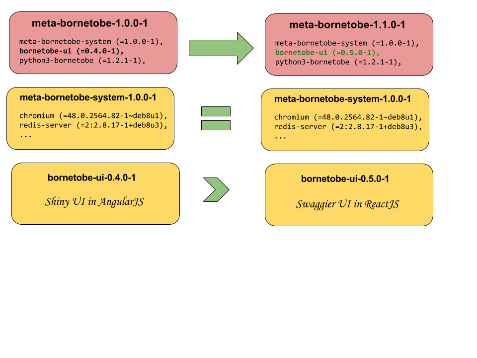
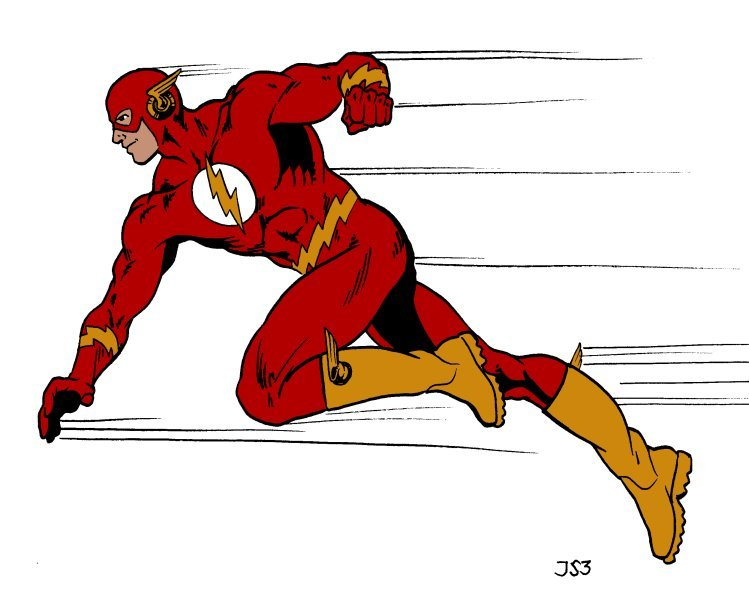

Robustesse & embarqué : concevoir une borne solide dans un monde hostile
========================================================================

----

Réseau de recharge
------------------

.. raw:: html

    

Réseau de recharge londonien pour les véhicules électriques

- Plus de 850 bornes de charge déployées par plusieurs organisations
- Appel d'offre pour la gestion du parc gagné en 2014 par le groupe Bolloré
- Un abonnement annuel à 10£ par véhicule électrique

----

Borne de Charge Autonome
------------------------

----

Partie électrique
------------------------

----

Borne en carton ?
------------------

Comment installe-t-on une borne sur le terrain ?

- S'assurer d'avoir le même comportement en production que sur nos bancs de tests
- Rendre les bornes distinctes malgré une image unique

----

Test de température
-------------------

Presenter Notes
---------------

- On place la borne dans une étuve pour valider son fonctionnement de -25 à 40 degrés

----

Test d' étanchéité
-------------------

Presenter Notes
---------------

- On test l'étanchéité de la borne face à des projections d'eau dans toutes les directions
- Pour les bornes les plus malchanceuses on test solidité de toutes les pièces fragile en lachant des poids dessus

----

Test de charge (électrique)
---------------------------

Presenter Notes
---------------

- On souhaite s'assurer qu'un véhicule qui se comporte mal ne puisse pas endommager la station
- Quand un client vient brancher son véhicule et que la borne autorise la charge, c'est le véhicule qui devient maitre du cycle de recharge 
- La borne communique au véhicule un amperage maximal à ne pas dépasser en se basant sur le type de cable et des règles de limitation de la charge.

----

Création de l'image
------------------

.. raw:: html

            

Presenter Notes
---------------

- On souhaite avoir un comportement predictible et similaire sur les bornes qu'on installe
- Les bornes sont installées par des techniciens sur place donc il faut que cela soit automatisable

----

Metapackaging Debian
-----------------

Nous utilisons un repository Debian privé contenant des meta-packages figeant toutes les dépendances
de notre système.

Presenter Notes
---------------

- meta-paquet : paquet contenant uniquement des metadonnées dont une liste dépendences
- composition de metapaquets pour décrire l'intégralité des paquets nécessaires au bon fonctionnement des bornes
- Signature des meta-données des snapshots pour que seul notre code soit déployable

----

Sur le terrain
--------------

- Flashage automatique via une clef USB
- Logiciel de test disponible directement sur la borne

.. raw:: html

    

Presenter Notes
---------------
- On ne va pas livrer une clef USB à chaque release car ce n'est pas pratique
- Les bornes étants souvent racordé en 3G on ne peut pas se permettre d'envoyer toute une image d'un coup 

----

Des mises à jour qui roulent
----------------------------

Presenter Notes
~~~~~~~~~~~~~~~

- Faire du matériel comme du logiciel traditionnel
- Vivre avec les imprécisions
- Déployer des mises à jour rapidement, à distance
- Anecdote de la prise et son socle
    * Evoquer les solutions non-envisageables

----

Légende
-------

.. figure:: res/naive.png
   :height: 200px

   Approche naïve

   Approche robuste

----

Régime autoritaire
------------------

.. raw:: html

    

.. image:: res/ansible.png
   :height: 500px

Presenter Notes
~~~~~~~~~~~~~~~

- On connait bien
- Impossible de savoir si les bornes sont dispos

----

Coup d'État
-----------

.. raw:: html

    

.. image:: res/saltstack.png
   :height: 500px

Presenter Notes
~~~~~~~~~~~~~~~

- Master2minion et minion2master
- Pouvoir aux minions
- Garde la possibilié de contact depuis le master

----

Haute (in)disponibilité
-----------------------

.. raw:: html

    

Presenter Notes
~~~~~~~~~~~~~~~

- Mise à jour potentiellement longue
- Parcours client impacté

----

Assurer un service continu
--------------------------

.. raw:: html

    

Presenter Notes
~~~~~~~~~~~~~~~

- Mise à jour sur une seconde partition
- Borne disponible pendant la mise à jour
- Transparent pour le client (ou presque)

----

Oui, mais...
------------

- Les partitions doivent être identiques
- mais l'installeur Debian n'installe que sur une partition
- du coup on fait un rsync à la fin de l'installation pour répliquer le contenu
- mais les partitions diffèrent naturellement à l'usage
- et puis grub inverse ses entrées quand il est installé dans un chroot
- systemd ne supporte pas la manipulation de services dans un chroot
- systemd-nspawn permet de simuler un boot complet de la seconde partition
- mais du coup des services non compatibles se lancent et entrent en conflit avec l'hôte (redis par exemple)
- donc on écrit des services qui vont se lancer au tout début et masquer les autres
- on oublie pas de restaurer en quittant le conteneur

Presenter Notes
---------------

- process preseed + salt + rsync => image générique
- cette image qu'on utilise pour nos tests iso-prod et pour la clef
- configurée quand on flash => diff partitions

----

Faire un saut périlleux...
--------------------------

.. raw:: html

    

Presenter Notes
~~~~~~~~~~~~~~~

- On a déjà vu les problèmes d'indisponibilité
- Risque de rendre la partition unique inutilisable
- Intervention nécessaire => argent et mauvaise impression client

----

Et retomber sur ses pieds !
---------------------------

.. raw:: html

    

Presenter Notes
~~~~~~~~~~~~~~~

- Plusieurs tests à effectuer après le reboot sur la seconde partition
- Test de boot
- Kernel panic -> grub fallback
- Tests métiers -> next slide

----

Dans le doute, reboot
---------------------

.. raw:: html

    

Presenter Notes
~~~~~~~~~~~~~~~

- Expliquer le check-boot et les relances de services et reboot
- Tout est testé à Berri
- preseed et salt utile pour générer une borne quasi iso-prod
- toujours un risque -> c'est pourquoi on a prévu tout ça

----

Merci pour votre attention !
============================
