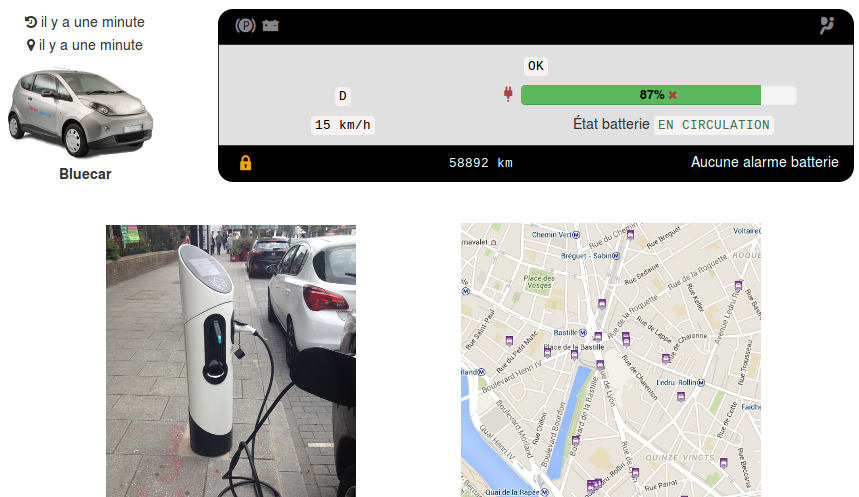
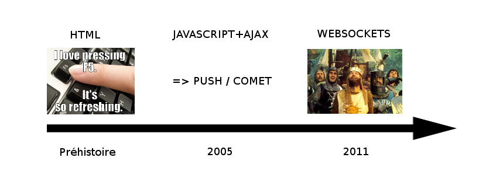
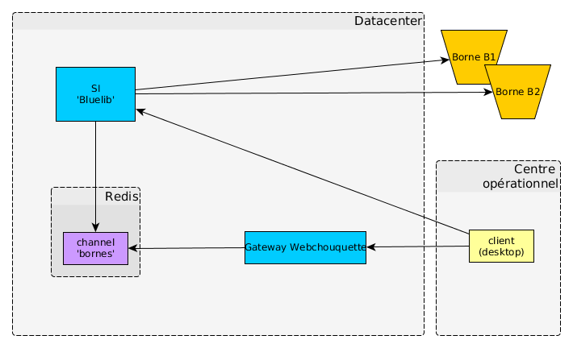
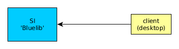
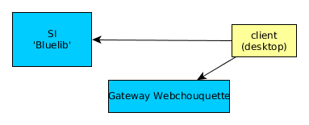
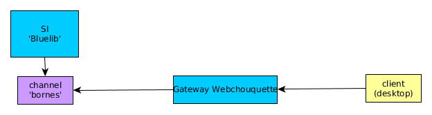
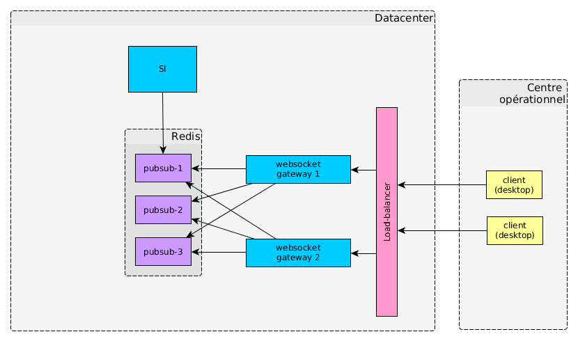
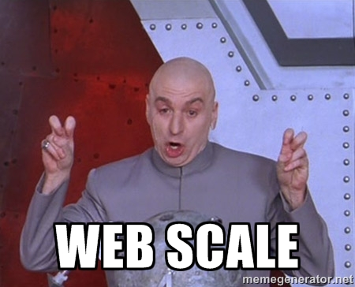

.. raw:: html

    

        
            Webchouquette
        
    

.. raw:: html

    

        
            Pousser des alarmes en <strong>temps réel</strong> sans transiger sur la performance ou la sécurité
        
    

.. notes:
    Django / AngularJS => vers des interfaces dynamiques en JS.
    Pour que ce soit encore + dynamique: interfaces temps réel. Nécessite un dev => Webchouquette

----

Cas d'usage
===========

.. notes:
    Existe déjà: supervision d'alarmes
    Tableau de bord TR: en cours de dev
    Aussi: carte de positionnement de véhicules
    Préz du cas d'étude: déploiement de borne dans toute la france
    pour le démonstrateur on va vouloir en superviser 1
    Transition: pourquoi ce n'est pas trivial, pourquoi ça nécessite un dev ?

----

Interfaces web et "temps réel"
==============================

.. figure:: Client-server-model.png
    :height: 150px

**Webchouquette: websockets + filtrages et permissions**

.. notes:
    a l'initiative du navigateur
    la touche F5 est ton amie
    AJAX: a l'initiative du navigateur mais pas de l'utilisateur
    point javascript: langage permettant rendre la page dynamique sans recharger depuis le serveur
    Evolutions: PUSH or COMET (HTTP overhead) des hack pour simuler une liaison bi-directionnelle
    'long polling': on tire avantage du fait qu'il peut y avoir de la latence => le serveur répond
    quand il a de nouvelles données
    2011: arrivée des websockets:
    communication persistente, bi-directionnelle sur une unique connection TCP
    webchouquette s'appuie sur websocket, ajoute permissions et filtrage

----

Introducing Webchouquette
=========================

.. notes:
    Fil rouge de la prez: vous êtes Roger en charge de superviser la borne B1 pour un démonstrateur
    sur lequel VB a un oeil attentif. B2 est une borne concurrente, vous n'avez pas le droit de voir son état

----

Initialisation de l'App, classique
==================================

1. ``GET bluelib.com/supervision/ HTTP/1.1``
2. Réponse serveur: statics (HTML, CSS, JS...)
3. Actions utilisateurs... ou pas
4. ``GET bluelib.com/api/B1 HTTP/1.1``
5. Réponse serveur: infos de la borne B1::

.. code-block:: js

    {
        "uid": "B1",
        "status": "T's'all good",
    }

----

Souscription à des alertes
==========================

1. ``GET bluelib.com/api/get_subscription?borne=B1 HTTP/1.1``
2. Réponse serveur: message de souscription::

.. code-block:: js

    {
        "class": "subscribe",
        "app_id": "bluelib",
        "channels": {
            "bornes": {
                "filters": "{\"alarm\": {\"level\": \"critical\", \"borne\": [\"B1\"]}}.5wCf588fwBBiQDCjWbAq0"
            }
        }
    }

3. Ouverture d'un websocket SSL ``Client <-> Gateway``
4. Le Client forwarde la souscription
5. La gateway confirme la souscription

.. notes:
    L'authentification est faite par le SI pour que ce soit plus simple (pas de double authent ou forcer SSO
    sur le load balancer)
    Secret partagé entre la gateway Webchouquette et le SI pour vérifier que les filtres sont légaux
    websocket SSL entre app JS et la gateway Webchouquette parce qu'on est en HTTPS de base

----

Les messages
============

bloc commun (format JSON):

.. code-block:: js

    {
        "class": "reset",
        "timestamp": "2014-03-07T19:18:03.124578Z",     // Timestamp in ISO8601 format
        "uuid": "f47ac10b-58cc-4372-a567-0e02b2c3d479"  // Universally-unique ID
    }

les ``class`` que nous utilisons:

- subscribe
- ack
- reset
- data

----

Notification par le SI
======================

Exemple de message:

.. code-block:: js

    {
        "class": "data",
        "timestamp": ...
        "uuid": ...
        "event_kind": "alarm",
        "keywords": ["borne:B1", "level:critical"],
        "data": {
            {
                "uid": "B1",
                "status": "oh,oh...",
            }
        }
    }

.. notes:
    On ne reçoit pas les infos de la borne B2

----

résilience
==========

.. notes:
    Mécanismes de reprise: Si Redis crash, gateway retente connection et notifie les client JS
    Si gateway tombe les clients tentent automatiquement de se reconnecter
    Redondance: backup Redis, plusieurs gateways
    => pas SPOF du à la duplication
    => possibilité de passer à l'échelle si plus de clients JS / de messages à faire transiter

----

----

Monitoring
==========

Un serveur de commande connecté à la Gateway pour monitorer:

- Le statut de la gateway
- Des métriques sur les messages

----

Vers l'open-source et au delà
=============================

- Besoins métiers variés
- Architecture générique
- Des solutions alternatives ?
- L'open source, c'est bien

----

.. raw:: html

    

        
            Merci ! Des questions ?
        
    

