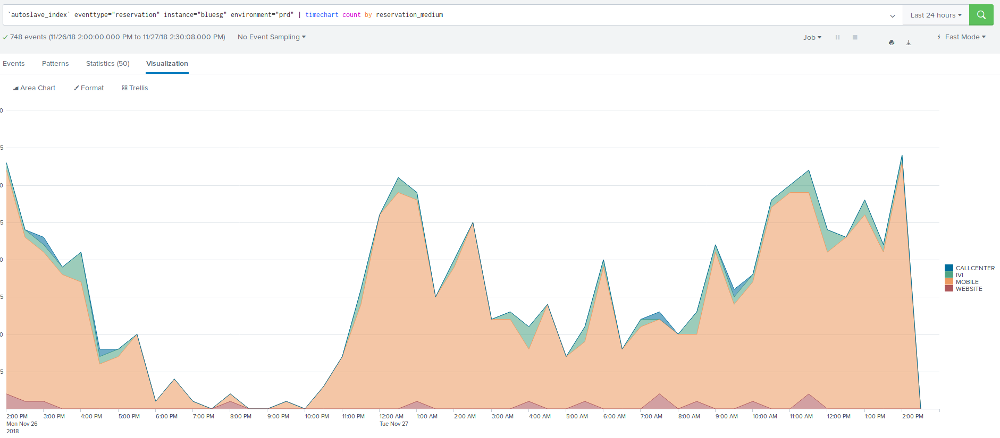
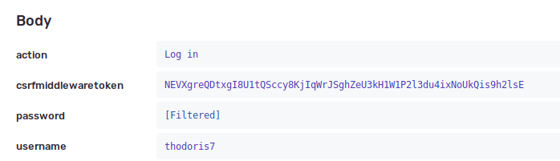

Au sujet des logs automagiques
==============================

----

Qui suis-je ?
=============

- Vincent Desprez
- Chez Polyconseil depuis deux ans
- Principalement sur les sujets finance et abonnement

----

Pourquoi logguer ?
=================

- Debug (logs techniques)
- Traçabilité (logs "métier")
- Analyses / dashboards grâce à splunk / kibana / … (logs techniques ou métier)

----

Splunk : répartition de réservations
====================================

----

Logguer facile grâce à un décorateur
====================================

.. code-block:: python
    :emphasize-lines: 11 

    def fmt_params(*args, **kwargs):
        all_items = [str(a) for a in args]
        all_items.extend(
            f'{k}={v}' for k, v in sorted(kwargs.items())
        )
        return ', '.join(all_items)

    def auto_logging(decorated):
        @functools.wraps(decorated)
        def wrapper(*args, **kwargs):
            logger = logging.getLogger(decorated.__module__)
            logger.info(
                '%s(%s)',
                decorated.__name__,
                fmt_params(*args, **kwargs),
            )
            return decorated(*args, **kwargs)
        return wrapper

----

Utilisation de auto_logging
===========================

.. code-block:: python

    @auto_logging
    def my_func(a, b, c):
        do_something(a, b, c)

    >>> my_func(1, 2, c=293)

Dans le fichier de logs
-----------------------

.. code-block:: sh
    
    $ cat log.txt
    my_func(1, 2, c=293)

----

L’occasion d’ajouter quelques goodies
=====================================

.. code-block:: python
    :emphasize-lines: 2,12

    def operation(decorated):
        decorated.alters_data = True

        @functools.wraps(decorated)
        def wrapper(*args, **kwargs):
            logger = logging.getLogger(method.__module__)
            logger.info(
                '%s(%s)',
                decorated.__name__,
                fmt_params(*args, **kwargs),
            )
            with transaction.atomic():
                return decorated(*args, **kwargs)
        return wrapper

----

C’est bien, mais…
=================

.. code-block:: python
    
    @operation
    def update_password(customer, new_password):
        do_update_password(customer, new_password)

Oh, les jolis mots de passe !
-----------------------------

.. code-block:: sh

    $> cat log.txt
    update_password('Jean-Louis', '123456')
    update_password('Léa', 'password321')
    ...

----

Filtrer les valeurs sensibles
=============================

.. code-block:: python

    MASKED_ARGUMENT_NAMES = ('password', 'pin', 'secret')

    def fmt_kwarg(key, value):
        if name in MASKED_ARGUMENT_NAMES:
            return '%s=<HIDDEN>' % key
        value = safe_repr(value)
        return '%s=%s' % (key, value)

    def fmt_params(*args, **kwargs):
        all_items = [str(a) for a in args]
        all_items.extend(
            fmt_kwarg(k, v) for k, v in sorted(kwargs.items())
        )
        return ', '.join(all_items)

----

C’est ce que fait déjà Sentry
=============================

----

Le retour du mot de passe
=========================

.. code-block:: python

    class PasswordUpdateForm(forms.Form):
        password = forms.CharField(...)
        password2 = forms.CharField(...)

    class PasswordUpdateView(views.FormView):
        form_class = PasswordUpdateForm

        def form_valid(self, form):
            update_password(self.request.user, **form.cleaned_data)
            return super().form_valid(form)

.. code-block:: sh

    $> cat log.txt
    update_password('Jean-Louis', password='<HIDDEN>',
    password2='123456')

----

Détecter les fuites dans les tests
==================================

- Forcer les mots de passe de tests à contenir une chaîne reconnaissable
- Vérifier que cette chaîne ne ressort pas dans les logs

----

Forcer le format des mots de passe de tests
===========================================

.. code-block:: python

    from django.conf import settings
    from django.contrib.auth import hashers

    class UnsaltedMD5PasswordHasherWithValidator(
            hashers.UnsaltedMD5PasswordHasher
    ):
        def encode(self, password, salt):
            if password and not password.startswith(
                    settings.TEST_PASSWORD_PREFIX
            ):
                raise ValueError(
                    "passwords should all be prefixed by '%s'."
                    % settings.TEST_PASSWORD_PREFIX
                )
            return super().encode(password, salt)

----

Vérifier les logs
=================

- Ajout d’un *handler* personnalisé au logger racine
- Ce handler ne fait que vérifier l’absence de `settings.TEST_PASSWORD_PREFIX`
  dans les logs
- À utiliser dans tous les tests !

----

Corriger les tests
==================

- Ajout d’une méthode ``get_password`` à notre ``TestCase`` personnalisé

.. code-block:: python

    >>> get_password('toto')
    'Pa$$w0rd!-toto'

- Utilisation de la méthode ``force_login`` de Django

.. code-block:: python

    >>> self.client.force_login(my_customer)

- Tester l’utilisation du *hasher* et du *log handler* !

----

En conclusion
=============

- Les logs c’est bien…
- Mais attention à ce qu’on met dedans
- Quid des autres données personnelles ?

----

Merci !
=======

----

Annexes
=======

----

Vérifier les logs
=================

.. code-block:: python

    class _StreamWithPasswordCheckHandler(logging.StreamHandler):
        def emit(self, record):
            msg = self.format(record)
            error = "Found password leaking in log"
            # check for error in msg to avoid infinite recursion loop
            if settings.TEST_PASSWORD_PREFIX in msg and error not in msg:
                raise AssertionError(f"{error}: {msg}")
            self.flush()

    @contextlib.contextmanager
    def check_leaking_passwords_in_logs():
        logger = logging.getLogger('')
        log_stream = io.StringIO()
        handler = _StreamWithPasswordCheckHandler(log_stream)
        logger.addHandler(handler)
        yield
        logger.removeHandler(handler)
