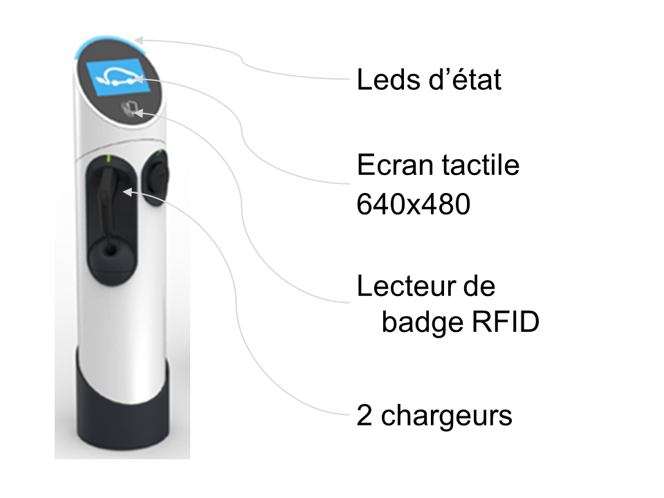
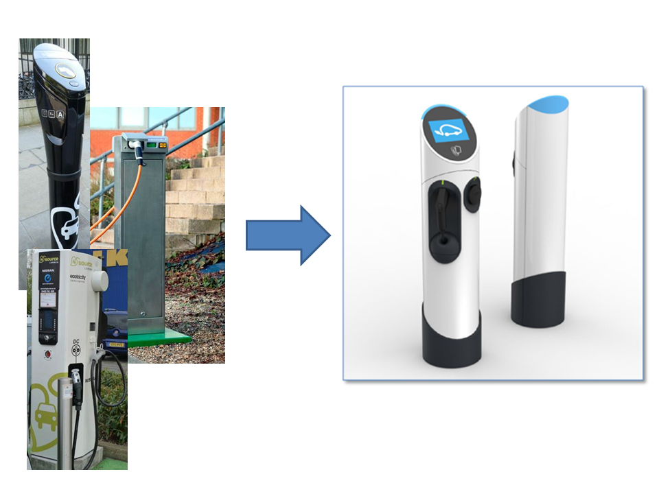
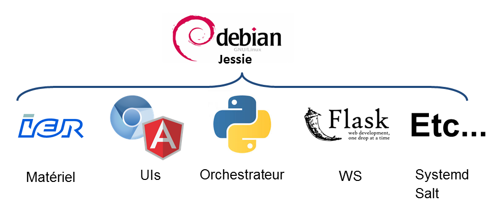
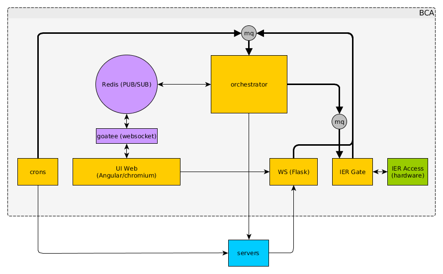
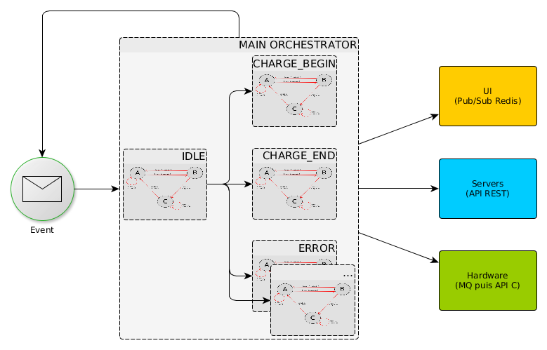
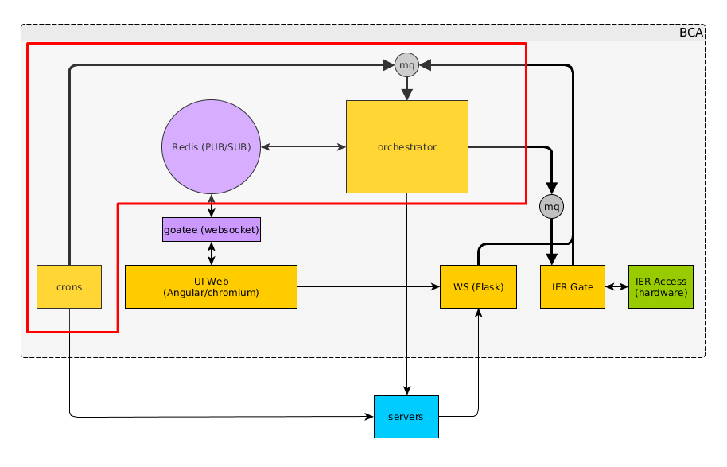
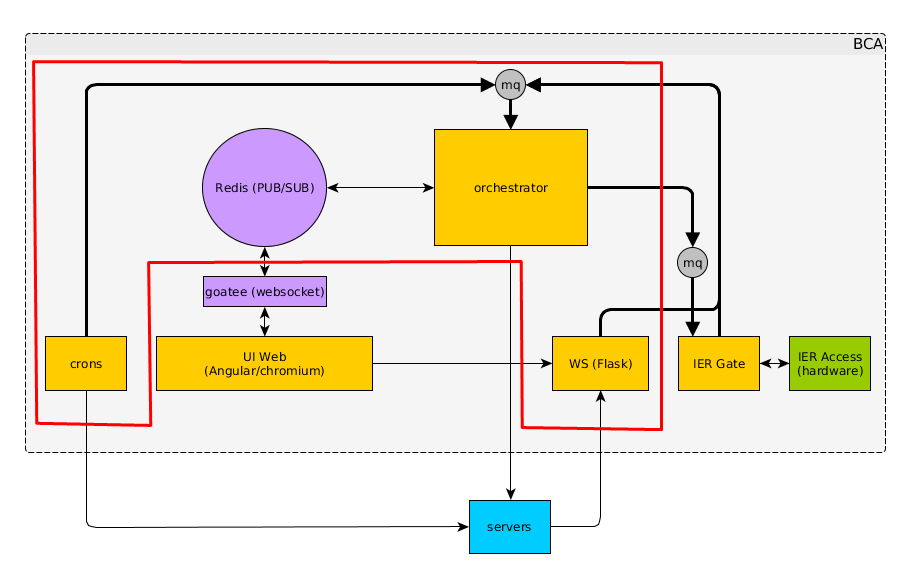
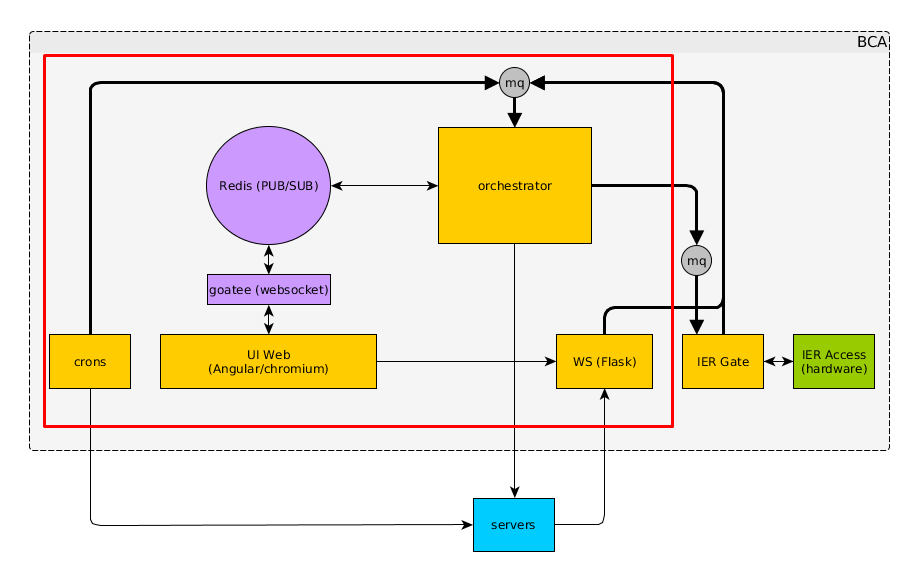

Chargez votre voiture grâce au web
==================================

----

La borne de charge
==================

    badge -> branche -> charge

----

L'existant : SourceLondon
=========================

    Remplacer l'existant pour améliorer la qualité.

----

Première architecture : PyQt
============================

PyQt semblait avoir pleins d'avantages :

- fait pour des interfaces lourdes
- robuste
- très utilisé

À l'usage, il nous a cependant semblé inadapté :

- API non pythonique
- non maîtrisé par l'équipe -> coût d'entrée pour tout nouveau développeur
- il impose une façon de faire
- gros overhead pour une fonctionnalité simple

----

Seconde architecture
====================

Finalement nous avons décidé de jouer sur nos forces : les UIs webs.

----

Vue de détail
=============

----

L'orchestrateur
===============

    gestion séquentielle des événements extérieurs

.. ----

.. Interfaces AngularJS
.. ====================

.. - sans état, simple (KISS)
.. - écoute sur un websocket et change la route à chaque publication
.. - cas spécifique pour le lancement -> doit demander à l'orchestrateur
.. - un template par route
.. - purement statique

----

Tests
=====

Les tests sont effectués en lançant l'orchestrateur dans un thread séparé et en vérifiant les interfaces (MQ, Pub/Sub Redis).

Tous les tests sont donc purement fonctionnels de l'allumage d'une borne à son extinction.

.. code-block:: python

    def test_charge_begin(self):
        # The charge point is powered up in the setUp
        self.card_swiped('charge_begin')
        self.assert_view(ui.PARKING_CHARGE_INSTRUCTIONS_VIEW)
        self.outlet_plugged('T1')
        self.assert_view(ui.WAITING_FOR_RESPONSE)
        self.assert_view(ui.CHARGE_BEGIN_BYE_VIEW)
        self.assert_set_light('green')
        self.assert_start_charge('T1')
        # Timeout, go back to idle
        self.assert_view(view=ui.WELCOME_VIEW)
        # The charge point is powered down in tearDown

----

Périmètre des tests (1)
=======================

Le périmètre peut être modifié en changeant la définition des actions.

----

Périmètre des tests (2)
=======================

De l'orchestrateur seul aux APIs.

----

Périmètre des tests (3)
=======================

À la borne complète en utilisant Selenium.

----

Rétrospectives de l'architecture
================================

.. raw:: html
    
    <ul class="simple" style='list-style-type:none;'>
        <li>✔ modulaire</li>
        <li>✔ comportement prédictible et sûr (pas de threads)</li>
        <li>✔ technologies maîtrisées par l'équipe et plus léger que PyQt</li>
        <li>✔ parfaitement pythonique (et JSique)</li>
        <li>✔ visualisation à distance de l'interface (de façon synchronisée)</li>
        <li>✔ les tests sont indépendants et pérennes</li>
        <li>✘ l'orchestrateur rajoute des indirections et du code</li>
        <li>✘ le couplage orchestrateur - vue AngularJS est fragile</li>
        <li>✘ pas d'appels bloquants</li>
        <li>✘ saviez-vous qu'un swipe de droite à gauche dans chromium retourne en arrière ?</li>
    </ul>

----

Merci de votre attention
========================

Des questions ?
