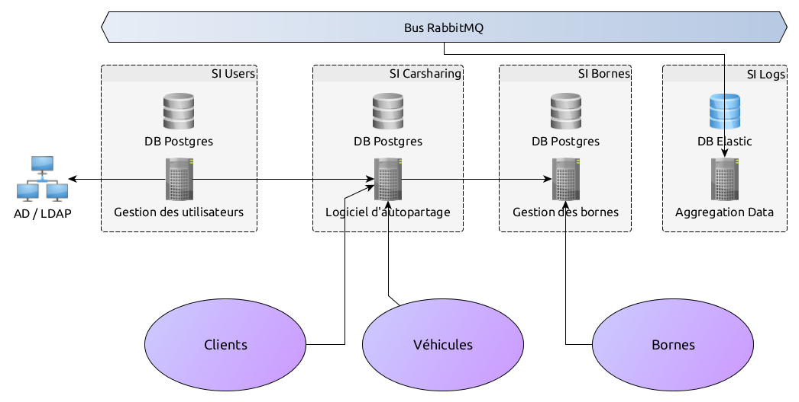

Tests d'intégration automatisés
===============================

----

Une minute à propos de moi
==========================

- Victor Perron
- Fête mes 2 ans chez Polyconseil
- Troisième DjangoCong !
  
.notes: (e-mails, javascript tools)

.notes: Ma "conférence" préférée de très loin. Sympa, petite

.notes: Généralement plutot des lightning, donc je vais essayer de gagner du temps

.notes: Et puis mes lightning ont toujours dépassé donc...

----

Pourquoi ces tests ?
====================

.. figure:: integration_header.png

.notes: Caricature d'une intégration. Chez nous 3 usages

----

Différentes raisons 
===================

1. Intégration entre différents modules
2. Tests fonctionnels systématiques
3. Interfaces "pures" (on pense Javascript)
4. Documenter et valider le fonctionnement global

.notes: modules soft/hard externes comme véhicules, autres logiciels, etc

.notes: détecter et s'assurer de fonctionnement microservices avant la mise en prod

.notes: une equipe de validation manuelle est vite surchargée

.notes: lorsque les mocks ne suffisent plus; particulièrement interfaces JS. Vrai en dev

----

Contexte: Service d'autopartage
===============================

----

Cas 1: Intégration entre modules
================================

Pouvoir développer efficacement un backend réparti
entre plusieurs microservices.

Exemples
--------
- Synchronisation entre système maître et esclaves.
- Remplacement d'un système par un autre

.notes: Utilisateurs par exemple

.notes: Transformation en microservices

Environnement principal
-----------------------
Développement

----

Cas 2: Tests fonctionnels
=========================

Pouvoir vérifier le bon fonctionnement et la
non-régression de fonctionnalités distribuées
ou complexes.

Exemples
--------
- Une prise de location ou d'abonnement doit toujours fonctionner
- Recherche systématiques d'erreurs dans les logs (console ou browser)
- Le contexte technique ou métier doit pouvoir varier (traductions,
  instances paramétrées différemment...)

.notes: plusieurs déploiements du meme logiciel: langues différentes, backend, features parfois très différentes (charge ou non...)

Environnement principal
-----------------------
Serveur d'intégration continue (CI)

----

Cas 3: Interfaces graphiques
============================

Pouvoir développer efficacement une interface "front-end" sans
avoir à "mocker" un, deux, 4 ou 10 serveurs.

Exemples
--------
- Authentification d'une application
- Traduction "dynamique" de l'application
- Détecter au plus tôt les changements d'API brutaux

.notes: Beaucoup du test d'une interface se fait au niveau métier, pas unitairement

.notes: En REST il est très compliqué de conserver des contrats d'API verrouillés. LE plu logique et rapide est de vérifier systématiquement.

Environnement principal
-----------------------
Développement.
Puis CI à chaque MAJ de l'application ou d'un backend.

----

Cas 4: Documentation du déploiement
===================================

Constituer une "répétition générale" avant la production qui documente
l'allumage d'un système entier, en prenant en compte ses paramètres
particuliers.

Tester des fonctionnalités "comme en prod".

Exemples
--------
- Configuration "prod-only": SSL, HOSTS, CORS, CSRF, authentification
- Outils "support": Sentry, aggrégateur de logs, ...

Environnement principal
-----------------------
Développement

----

Solution: une machine virtuelle
===============================

- Idée d'une VM de développement pas neuve
- Outils de développement (PostgreSQL, Rabbit, Redis, ...)
- Lancement d'un nombre arbitraire d'applications dans cette VM
- Outils de contrôle et configuration
- Backends libvirt+qemu, VirtualBox pour les non-Linux
- Utilisation extensive de *Docker* et *Systemd*
- Système basé sur *mDNS* pour les URLs
- Tests lancés en externe depuis la machine de dev.

.notes: Au départ, plutot pour éviter de polluer son poste

----

VM d'intégration: en images
===========================

.. figure:: architecture.png
    :height: 480px

----

Prérequis & challenges
======================

- [x] Patience infinie puis génération automatisée de la VM
- [x] Standardisation au maximum de la configuration de nos applications
- [x] Gestion des images d'application avec sélection de "la dernière"
- [x] Service mDNS "maison" pour faire du broadcast
- [x] Utilisation de systemd pour le lancement et le cleanup d'applications
- [x] Cadre autour de Selenium et de pilotage à distance pour lancer les tests
- [ ] Tests "riches" encore à écrire (1 action => N vérifications intersystèmes)
- [ ] Gestion d'une collection de "fixtures" pour chaque cas
- [ ] Gestion de backup/restore multi-database efficaces

.notes: système de configuration & lancement proche, gestion des URLs intersystème

.notes: métadonnées nécessaires: ports d'écoute, ports de supervision, introspection, logging

.notes: Docker a énormément aidé à considérer nos applicatifs comme des exécutables simples

.notes: Maux de crâne pour déterminer quand un service est "vraiment prêt"

----

That's all folks !
==================

Questions !
