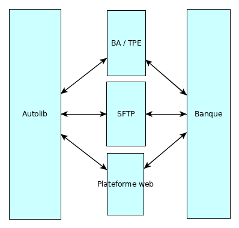
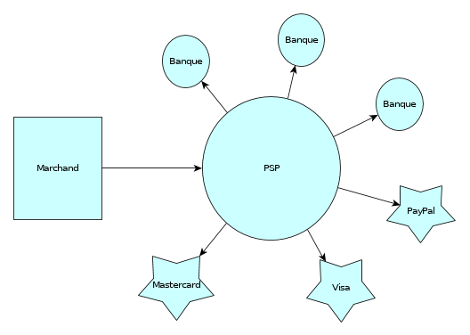

Faire payer ses utilisateurs, facile ?
======================================

----

Qui suis-je ?
=============

- Vincent Desprez
- Django depuis la 1.3 !
- Chez Polyconseil depuis deux ans
- Principalement sur les sujets financiers

----

Quand je suis arrivé chez Polyconseil
=====================================

- 6 flottes opérées dans 4 pays
- 2 banques partenaires (Europe, USA)
- 2 nouvelles flottes en perspective : Singapour, Los Angeles
- Cheminement du paiement :

  - Enregistrement de carte à l’abonnement
  - Débit plus tard

----

En simplifié ?
==========================

----

Quelques bizarreries
====================

- Les paiements récurrents ne passent pas par le même canal suivant si la carte a été enregistrée sur le web ou en borne
- Premier paiement après un enregistrement en borne =  "pré-autorisation", ensuite "vente à distance"
- 6 formats de fichiers SFTP différents
- Fichiers de longueur fixe

.. code-block:: text

    33  C.M.  REMUT 11899                1506060
    73253000000100051329999999999991406060000000000000008
    0000000000000042D000000001338                       
           160606  0000000000000008000000000000004210000
                                 \r\n

----

2 partenaires bancaires, une bonne idée ?
=========================================

- Grosse base de code

  - deux fois le code d’interfaçage
  - deux fois plus de tests
  - deux fois plus de bugs
  - couche d’abstraction

- Coûts de maintenance élevés
- Apprentissage difficile

----

Un PSP pour les gouverner tous
==============================

.. image:: Worldline_logo.png
    :height: 50px
    :align: left

.. image:: Alipay_logo.png
    :height: 50px
    :align: right

----

Choix d’un nouveau prestataire de paiement
==========================================

- Liens avec de nombreuses banques dans le monde
- Transmission de la réconciliation bancaire
- Pas de transit des données sensibles par nos serveurs

Le choix final : Worldpay
-------------------------

- Prestataire de services de paiement universel
- Présent en Europe, aux États-Unis, à Singapour entre autres
- Ancienne filiale de RBS, Racheté en 2017 par Vantiv

----

L’API XML, simple et bien documentée
====================================

- Seulement trois types de requêtes

  - Nouveau paiement
  - Modification d’un paiement
  - Demande d’informations sur un paiement

- Et un seul point de retour : les **Order Notifications**

----

Requête minimale
================

.. code-block:: xml

    <paymentService version="1.4" merchantCode="POLYCONSEIL">
      <submit>
        <order orderCode="PAIEMENT_1" installationId="1234567">
          <description>5 chemises de soie bleue</description>
          <amount currencyCode="EUR" exponent="2" value="5000"/>
          <paymentMethodMask>
            <include code="ALL"/>
          </paymentMethodMask>
        </order>
      </submit>
    </paymentService> 

----

Réponse de Worldpay
===================

.. code-block:: xml

    <paymentService version="1.4" merchantCode="POLYCONSEIL">
      <reply>
        <orderStatus orderCode="PAIEMENT_1">
          <reference id="REFERENCE">https://payments-test.worldpay.com/app/hpp/integration/wpg/corporate?OrderKey=PAIEMENT_1&amp;Ticket=00146321872957902pqKhCTUf0vajKCw-X5HqZA</reference>
        </orderStatus>
      </reply>
    </paymentService>

Le client est redirigé vers l’URL indiquée dans la balise ``reference``

----

Une vue minimale
================

.. code-block:: python

    from django.shortcuts import redirect
    import requests
    import my_worldpay_implem

    class PayInvoiceView(FormView):
        def form_valid(self, form):
            xml_string = my_worldpay_implem.get_worldpay_xml(
                amount=form.cleaned_data['amount'], description=...)
            xml_response = requests.post(
                settings.WORLDPAY_PAYMENT_SERVICE_URL,
                data=xml_string,
                auth=settings.WORLDPAY_AUTH,
                headers={'Content-Type': 'text/xml'},
            )
            return redirect(
                my_worldpay_implem.get_redirect_url(xml_response)
            )

----

Création d’un jeton
===================

.. code-block:: xml
    :emphasize-lines: 6

    <paymentService version="1.4" merchantCode="POLYCONSEIL">
      <submit>
        <order orderCode="TS211010">
          <description>5 chemises de soie bleue</description>
          <amount value="5000" currencyCode="EUR" exponent="2"/>
          <createToken tokenScope="merchant"></createToken>
          <paymentMethodMask>
            <include code="ALL"/>
          </paymentMethodMask>
        </order>
      </submit>
    </paymentService>

=> Possibilité de créer un jeton lors du paiement

----

Réutilisation du jeton
======================

.. code-block:: xml
    :emphasize-lines: 6,7,8,9,10

    <paymentService version="1.4" merchantCode="POLYCONSEIL"> 
      <submit>
        <order orderCode="T0211010">
          <description>5 chemises de soie bleue</description>
          <amount currencyCode="EUR" exponent="2" value="5000"/>
          <paymentDetails>
            <TOKEN-SSL tokenScope="merchant"> 
              <paymentTokenID>efnhiuh7438rhf3hd9i3</paymentTokenID>
            </TOKEN-SSL>
          </paymentDetails>
        </order>
      </submit>
    </paymentService>

----

Paiements par lots grâce aux jetons
===================================

.. code-block:: xml
    :emphasize-lines: 2,15

    <submit>
      <orderBatch transaction="2" merchantBatchCode="0001">
        <order orderCode="T0211010">
          <description>5 chemises de soie bleue</description>
          <amount currencyCode="EUR" exponent="2" value="5000"/>
          <paymentDetails>
            <TOKEN-SSL tokenScope="merchant"> 
              <paymentTokenID>efnhiuh7438rhf3hd9i3</paymentTokenID>
            </TOKEN-SSL>
          </paymentDetails>
        </order>
        <order orderCode="T0211011">
          ...
        </order>
      </orderBatch>
    </submit>

----

Génération du XML
=================

- Jinja 2

  - Plus performant que les templates Django
  - ``ElementTree`` surdimensionné car le XML est très simple

- Validation à chaque requête grâce au ``DTD`` de Worldpay

----

Order Notification
==================

- requête POST envoyée à chaque changement d’état d’un paiement

  - et il y a beaucoup d’états !
  - en fait peut-être, on choisit
  - dans notre cas ``AUTHORIZED``, ``ERROR``, ``CANCELLED``, ``REFUSED``, ``CAPTURED``

- ``XML`` similaire à celui des requêtes, fournit :

  - le nouvel état
  - le jeton éventuel
  - des détails sur le moyen de paiement utilisé (date d’expiration…)

----

Attendre l’Order Notification
=============================

.. code-block:: python

    class AwaitPaymentConfirmationMixin:

        def get_dispatch_url(self):
            raise NotImplementedError()

        def check_payment_result(self):
            raise NotImplementedError()

        def get(self, request, *args, **kwargs):
            payment_ok = self.check_payment_result()
            if request.is_ajax():
                return JsonResponse({'payment_ok': payment_ok})

            if payment_ok:
                return redirect(self.get_dispatch_url())
            return super().get(request, *args, **kwargs)

----

Fiabiliser les enregistrements de carte
=======================================

- Visa et Mastercard : "zero-value authorization"

  - Même niveau de sécurité qu’un vrai paiement
  - Permet le 3DS, la vérification du CVV etc.

- American Express et Diners : on triche un peu

  - débit de 1 dollar
  - annulé automatiquement dans la minute

----

Quelques goodies
================

- Un serveur de test complet (``OrderNotification`` par email)
- Des rapports

  - Nombreux (≃ 60 types disponibles)
  - Lisibles par un humain
  - Paramétrables en format, colonnes, envoi programmé

----

Le PSP, un choix déterminant
============================

- Possibilités techniques

  - Affectent le business model
  - Mais aussi les process internes

- Facilité d’intégration et de maintenance
- Disponibilité géographique
- Taux d’acceptation
- €€€

----

Le choix de Worldpay : un bilan
===============================

- Implémentation relativement facile
- Aucun incident de paiement pour l’instant
- Un support très disponible

Des regrets ?
-------------

- Pas de gestion des TPE, du moins pas partout
- Expérience utilisateur identique partout dans le monde, pour le meilleur et pour le pire
- Potentiel de l’API Worldpay sous-exploité du fait de nos process actuels

----

Merci
=====
