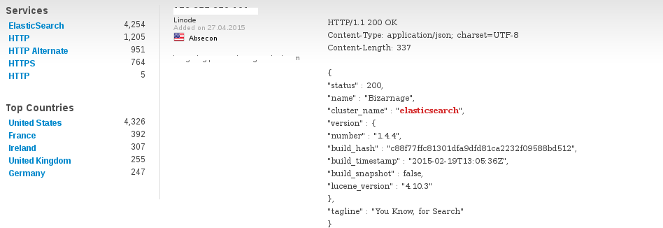

Elasticsearch 101
=================

----

Who am I
--------

Senior developper at Polyconseil since 3 years. I work on the telemetry projet: we communicate with our batteries, our cars, our busses ..

----

Summary
-------

* What is Elasticsearch

* How to use it (using python)

* How to manage it

----

Disclamer
---------

Elasticsearch must not be your first data storage.

It's prone to data loss on some circumstances like a network partition.

1.Read aphyr blog post https://aphyr.com/posts/323-call-me-maybe-elasticsearch-1-5-0
2.About split brain https://en.wikipedia.org/wiki/Split-brain_%28computing%29

----

Disclamer (bis)
---------------

Don't let your elasticsearch alone on the net.

----

What is Elasticsearch
---------------------

You know, for search.

* Lucence based: text information extraction and indexation
* Full-Text search (Lucene)
* Document database
* Rest (CRUD) API with JSON data presentation
* Schema-less
* Multitenancy
* Distributed

----

Why do we use Elasticsearch
---------------------------

* To store the full telemetry of all our MDM devices.

Position, actual speed, batteries metrics, alarms, temperature ..

* To store business events to let operational know what happens in their service.

Events when a customer takes a car, Bank and payment events, facturation process..

----

Schema-less ?
-------------

I've said Elasticsearch is **schema-less.** Yes, the schema is **not enforced** by the database, but you can define a mapping, a definition on the type of the data: Integer, String, Dates, Datetimes.

So data are organized in **Indices**, like a **database** in a classical RDBM. Each Index has one or more type which can be interpreted as a **table**.

You can ask the Elasticsearch for the mapping of a type, or all the mapping in a specific index, and manage it:

http://localhost:9200/_mapping

----

Multitenancy ?
--------------

Elasticsearch is multi tenant. It means that **Types** and **Indices** are logically isolated, but you can query all of them at once::

    http://localhost:9200/index1,index2/type1/_search?attribute:value
    http://localhost:9200/index1/type1,type2/_search?attribute:value

----

Document and mapping
--------------------

I clearly enjoin you to prepare your index and create and manage the mapping yourself.

* A mapping is created dynamically, when adding a new document, or document with extra fields.
* Declare your nested object to have a correct result if you query them.
* Pay attention to your mapping.

----

Distributed
-----------

Elasticsearch stores data in **Shard**. Basically you have 5 shards per **Nodes**. Under the hood, ES will duplicate shards to one or multiple nodes.
Also, Shards will balance shards on nodes to spread the search load.

.. image:: images/elas_0204.png

----

Inserting data
--------------

* Using a river. A river is a kind of link between Elasticsearch and a service, for instance RabbitMQ, or Twitter.

* Using the index API. The index API is globally a POST onto an index, and a PUT to modify an existing document.

Note: There is also a bulk mechanism to index a lot of data.

----

Queries
=======

1. Elasticsearch is queryable via its URi api::

    http://localhost:9200/index/type/_search?attribute:value

2. Or using the Search API

Instead of passing all the arguments to the GET params, the whole query is passed in the **body** in JSON format. Elasticsearch queries can be very complex and verbose.

----

Query VS Filter
---------------

Queries will be more complicated than just an exact match on a field to a value.

Query and Filter are the same, but query specify how well the results is good with a ranking.

----

Queries
-------

All our single battery pack named "dosso-1-1"::

    curl -XGET http://localhost:9200/sta/pack/_search -d '
    {
        "filter": {
            "term": { "hrid": "dosso-1-1" }
        }
    }
    '

----

Queries
-------

All our metrics for packs a charge level between 25 and 85 %::

    curl -XGET http://localhost:9200/sta/pack/_search -d '
    {
        "filter": {
            "range": {
                "charge_level": {
                    "gte": 25,
                    "lte": 85
                }
            }
        }

    }
    '

----

Queries
-------

All together::

    curl -XGET http://localhost:9200/sta/pack/_search -d '
    {
        "query" : {
            "bool" : {
                "must" : [
                    { "term" : { "hrid": "dosso-1-1" } },
                    { "range": {
                        "charge_level": { "gte": 25, "lte": 85 }
                    } }
                ]
            }
        }
    }
    '

----

Faceting
--------

Faceting can be imagined as a **Group By** with a **count**. It's extensively used in online store, when you filter products by colors, brands, sizes... The page displays a counter of available products. The query will return both products results AND the facets (counts per brands for example).

----

Faceting
--------

----

Faceting
----

For instance::

    curl -XPOST "http://localhost:9200/sta/pack/_search" -d '

    {
     "filter" : {
        "range": {
            "charge_level": { "gte": 25, "lte": 85 }
        }
      },
        "facets" : {
          "hrid" : { "terms" : {"field" : "hrid"} }
        }

    }
    '

----

Aggregations
------------

Aggregations are an evolution of faceting, but it supports more aggregation functions, (min,max,sum,avg..), can be used on a deeper document::

    curl -XPOST "http://localhost:9200/sta/pack/_search" -d '
    {
        "size": 0,
        "aggs" : {
            "hrids" : {
                "terms" : { "field" : "hrid" }
            }
        }
    }

----

Suggester & more like this
--------------------------

Elasticsearch use Lucene to extract information using tokenizers, and analize the text to store it correctly. Thus, ES is able to search if a document match other documents, and return results with ranking score.

For instance, use the _analyze endpoint to see how ES analyze a text::

    curl -XGET "http://localhost:9200/_analyze" -d "dosso-1-5"

----

How to use it using python
==========================

----

Python libraries
----------------

Elasticsearch company (or elastic.co) offers two great modules::

    pip install elasticsearch
    pip install elasticsearch_dsl

And there is also an asyncio module, which is not compatible with elasticsearch_dsl::

    pip install aioes

----

Curl style
----------

As curl sample before::

    es = elasticsearch.Elasticsearch(['http://localhost:9200'])
    res = es.search(index='sta', doc_type='pack', body={
        'query': {
            'term': {'hrid': 'dosso-1-1'},
            },
        }
    })

----

Using combination
-----------------

**elasticseach_dsl** provides an ORM style, so as Django's one, and an easier way to query your data::

    es = elasticsearch.Elasticsearch()
    search = elasticsearch_dsl.Search(es)

    search.query('term', hrid="dosso-1-1")

    query = search
        .query('term', hrid="dosso-1-1")
        .filter('range', charge_level={'lte': 100}})

    query.execute()
    query.to_dict()

----

Using DocType
-------------

A **DocType** is like a Django model::

    class Pack(elasticsearch_dsl.DocType):
        hrid = elasticsearch_dsl.String(index='not_analyzed')
        charge_level = elasticsearch_dsl.Integer()

        class Meta:
            index = 'bluecap_pack'

    Pack.search().query('term', hrid='dosso-1-1')
    pack = Pack(charge_level=50, hrid="dosso-1-1")
    pack.save()

----

Administrative tasks
--------------------

If your mapping changes, the data won't be updated, and **you need to reindex all your data**.
Es provides an API to reindex your actual data to a new one::

    elasticsedarch.helpers.reindex(
        client=elasticsearch.Elasticsearch(),
        source_index=idx1,
        target_index=idx2,
    )

Use **Aliases**! In order to not stop your service during data reindexation, you should use an alias on which your queries are done, reindex your data in a new index, and then set your alias to your new index when it's finished.

----

Elasticsearch ecosystem
-----------------------

Elasticsearch comes with a lots of plugins you should use (HEAD,). Rivers are also plugins (RabbitMQ River, Twitter River, Kafka river).

There is a python script plugin to do python in your queries.

Elastic.co provides **Shield** and **Marvel** to adds security and monitoring to your cluster.

----

Advises
-------

* Use index aliases
* Use more than one machine in your cluster
* Think about your mapping twice
* Close your unused indices

----

Questions
=========
