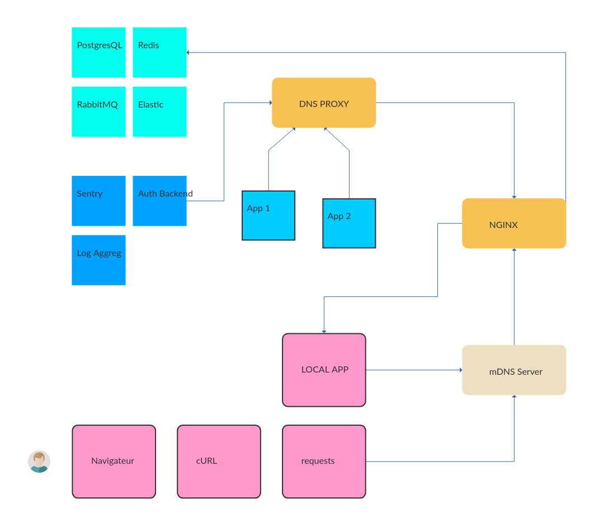

Environnement d'intégration
===========================

----

Présentations
=============

- Victor Perron
- Intérêts divers & variés :)
- Travaille chez Polyconseil.

On y fait du Django, de l'autopartage et surtout BEAUCOUP de tooling.

Pas mal d'OSS, bien que l'on puisse encore s'améliorer largement !

----

Pourquoi ?
==========

----

Différentes raisons 
===================

1. Tester les interactions entre plusieurs logiciels
2. Systématiser des tests fonctionnels
3. Cas spécifique des interfaces graphiques
4. Permet de documenter le déploiement final

----

Illustration: notre architecture
================================

A priori, rien de bien exotique.

----

Cas 1: Intégration entre modules
================================

Dès la phase de conception, pouvoir valider son code intersystèmes (oui, avant la production).

Exemples
--------
- Appels webservices en chaîne, avec des caches au milieu
- Synchronisation entre système maître et esclaves
- Refactoring: découpage ou remplacement d'un système par un autre

Environnement principal
-----------------------
Développement

----

Cas 2: Tests fonctionnels
=========================

Pouvoir vérifier automatiquement le bon fonctionnement et la
non-régression de fonctionnalités distribuées ou complexes.

Exemples
--------
- Une prise de location ou d'abonnement doit toujours fonctionner
- Vérification de l'absence d'erreurs dans TOUS les logs (backend ou frontend)
- Tester toutes les configurations possibles (toues les langues, combinaisons de paramètres...)

Environnement principal
-----------------------
Intégration continue (Jenkins, Travis...)

----

Cas 3: Interfaces graphiques
============================

Quasiment le cas 1, mais plus systématique: toute interface (UI) nécessite des mocks
de backend(s) pour être développée et validée par le métier et développée.

Exemples
--------
- Authentification d'une application
- Accès à des ressources variées (API REST ou autre)
- Traduction "dynamique" de l'application
- Lien avec (2): Détecter au plus tôt les changements d'API destructifs

Environnement principal
-----------------------
Développement & CI

----

Cas 4: Documentation du déploiement
===================================

Constituer une "répétition générale" avant la production qui documente
l'allumage d'un système entier, en prenant en compte ses paramètres
particuliers.

De plus cela permet d'éprouver les réglages "de prod".

Exemples
--------
- Test de la configuration "prod": SSL, HOSTS, CORS, CSRF, authentification
- Outils "support": Sentry, aggrégateur de logs, ...

Environnement principal
-----------------------
Développement; quelque part avant la prod :)

----

Solution 1: premières idées
===========================

Une *machine virtuelle* avec Vagrant. Ceci permet:

- De faire des rollbacks entiers
- De contrôler le temps
- De n'avoir aucune incidence sur la machine hôte

En réalité, les rollbacks:

- c'est TRES lent et mal supporté (par Vagrant, ET ses backends)
- ça prend énormément de place et c'est opaque
- ce n'est pas très granulaire.

----

Solution 2: une VM plus souple
==============================

Assouplir au maximum l'utilisation pour améliorer l'adoption.

- Oublions les rollbacks, la VM est maintenant *stateful*
- Séparation entre services *nécessaires* et *dépendants du test*
- Standardisation de tous les services avec Systemd+Docker
- Backends libvirt+qemu, VirtualBox

Les tests sont lancés en externe depuis la machine de dev.

----

VM d'intégration: en images
===========================

----

Solution 3: Environnement d'intégration
=======================================

- Gros soucis avec la virtualisation sous MacOS (30% de l'équipe)
- Très lourd à générer, en temps brut et en complexité
- En a-t-on VRAIMENT besoin ?

La solution:

- On n'utilise *que* Docker et du routage intelligent
- L'impact sur le systeme reste quasi nul
- Il faudra trouver quelque chose pour le faketime

C'est BEAUCOUP plus simple et rapide !

----

Principe de base
================

----

Description d'une application
=============================

.. code-block:: python

    S3 = TcpApp(
        's3server',
        'scality/s3server',
        'latest',
         8000,
         env_vars={
            'HOST_NAME': '{}'.format(conf.HOSTNAME),
         }
    )

    SENTRY = SentryApp(
        'sentry',
        'docker.polydev.blue/autoguard',
        entrypoint='bash',
        endpoints=[
            HttpEndpoint('www', 'start -b 0.0.0.0:9000', 9000),
            HttpEndpoint('wrk', 'celery worker -B'),
        ],
    )

----

Environnement d'intégration
===========================

----

Ce que cela résout
==================

- Permet de lancer tous les tests avec un minimum de tooling Python
- Maîtrise totale de l'environnement: pas de dépendances (SystemD, Fedora, libvirt...) à gérer
- Utilisable quasi directement sous MacOS. Au pire dans une VM :)
- Unification de l'espace de tests classique et d'intégration

----

Under the hood: environnement
=============================

- Un utilitaire nommé ``testenv`` permet de lancer un environnement complet

.. code-block:: shell

    testenv bootstrap --step all

- Trois étapes: DNS, Infra et Support
- Chaque nouveau service est lancé en tant qu'image Docker capable de joindre le DNS Proxy.
- Aucun impact sur le système: les ports ne sont pas exposés sur la machine.
- Tous les sites Nginx sont ajoutés dynamiquement

.. code-block:: shell

    docker kill -s SIGHUP

----

Under the hood: les tests
=========================

- Lancer et manipuler les applications directement depuis Python

.. code-block:: python

    from itutils import apps
    apps.SOME_SOFTWARE.start_and_wait()

- Utiliser ``py.test`` et contrôler avec Selenium, psycopg2 ou requests.
- Captures d'écran avec ``pytest-selenium``
- Swap à chaud d'un logiciel packagé et versionné et d'une version de développement: ``sitectl``

.. code-block:: shell

    $ ./manage.py runserver
    [...] development server listening on port 8000...

    $ sitectl set <SOFTWARE> out
    [...] nginx now redirecting <SOFTWARE> to localhost:8000

----

Demo time ! (1)
===============

----

Demo time ! (2)
===============

----

Demo time ! (3)
===============

----

Etat actuel
===========

- [x] Standardisation au maximum de tout l'applicatif
- [x] Un large tooling a été réalisé, beaucoup de helpers
- [x] De nombreux tests intersystèmes ont été écrits
- [ ] Encore (trop) souvent *flaky*; non bloquants pour le déploiement :(
- [ ] Finaliser l'environnement d'intégration et retirer la VM
- [ ] Aller encore plus loin sur le tooling de développement
- [ ] Résoudre le grandissant problème de l'organisation des *fixtures*

Un jour, l'Open Source ? On l'espère...

----

That's all folks !
==================

Merci pour votre attention !

Et désolé pour les yeux.

Questions !
